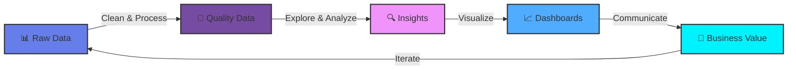

<div align="center">
  
</div>

<p align="center">
  <a href="https://git.io/typing-svg">
    
  </a>
</p>

<div align="center">
  
  
  
  <br/><br/>
  
</div>

<br/>

---

<div align="center">
  
## About Me

</div>

<table>
<tr>
<td width="50%" valign="top">

```yaml
Name:Rana Fayez Mahrous
Role: Data Science
location: Egypt 🇪🇬

- Ranked Master on Kaggle  
- AI Engineer focused on Machine Learning, NLP, Deep Learning
- AI Automation Engineer n8n | LLMs | AI Agents 
- Strong background in Data Analysis, Visualization & Predictive Modeling  
- Building AI automation systems using n8n workflows  
- Artificial intelligence Student — Egyptian Russian University  
- Arabic 🇪🇬 | English 🇬🇧  

```

</td>
<td width="50%" valign="top">

<br/>

<div align="center">
  
</div>

</td>
</tr>
</table>

---

<div align="center">

### 🎨 My Data Analytics Journey



<sub><i>The continuous cycle of data-driven decision making</i></sub>

</div>

---

## 🛠️ Tech Stack & Tools

<div align="center">

### 💻 Programming Languages

<p>
  
</p>

### 📊 Data & Analytics

<table>
  <tr>
    <td align="center" width="25%">
      <h4>Analysis</h4>
      <br/>
      <br/>
      <br/>
      
    </td>
    <td align="center" width="25%">
      <h4>Visualization</h4>
      <br/>
      <br/>
      
    </td>
    <td align="center" width="25%">
      <h4>Databases</h4>
      <br/>
      <br/>
      
    </td>
    
  </tr>
</table>

### 🧰 Development Tools
<p>
  
</p>

### Application Development

<p align="center">
  
  
  
</p>


---

## 🚀 Featured AI & Data Projects

- Hotel Booking Data Analysis — Ml & EDA insights  
- HR Analytics Dashboard — Attrition & KPI monitoring  
- Sales Analytics Dashboard — Revenue & business performance  
- Machine Learning Models — Regression, Classification & Evaluation  
- NLP & Deep Learning Focused On Story Generation
  
---

## 📊 GitHub Statistics

<div align="center">

<a href="https://github.com/ranafayez6">
  
  
</a>

<br/>

<a href="https://github.com/ranafayez6">
  
</a>

</div>

---

## 📫 Let's Connect!

<div align="center">

<table>
  <tr>
    <td align="center" width="25%">
      <a href="mailto:rfayez146@gmail.com" title="rfayez146@gmail.com">
        
        <br/><br/>
        
        <br/><br/>
        <b>Let's Talk</b>
      </a>
    </td>
    <td align="center" width="25%">
      <a href="https://www.linkedin.com/in/rana-fayez-69b975387/" title="LinkedIn Profile">
        
        <br/><br/>
        
        <br/><br/>
        <b>Connect</b>
      </a>
    </td>
    <td align="center" width="25%">
      <a href="https://github.com/ranafayez6" title="GitHub Profile">
        
        <br/><br/>
        
        <br/><br/>
        <b>Follow</b>
      </a>
    </td>
    <td align="center" width="25%">
      <a href="https://www.kaggle.com/ranafayezz" title="Kaggle Profile">
        
        <br/><br/>
        
        <br/><br/>
        <b>Compete</b>
      </a>
    </td>
  </tr>
</table>

</div>

---

<div align="center">
  


<br/>


<br/><br/>

**⭐ If you like what you see, consider starring this repository! ⭐**


<sub>Last Updated: May 2026 • Made by Rana Fayez</sub>

**💡 Remember:** *"The best way to predict the future is to analyze the data."* 📊✨

</div>
